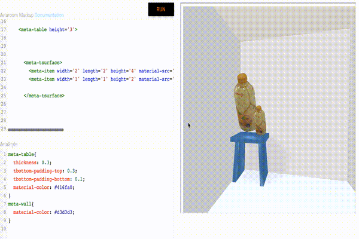
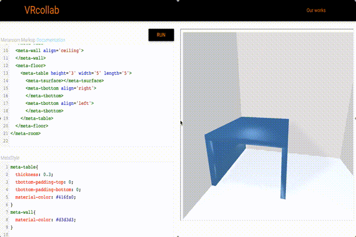
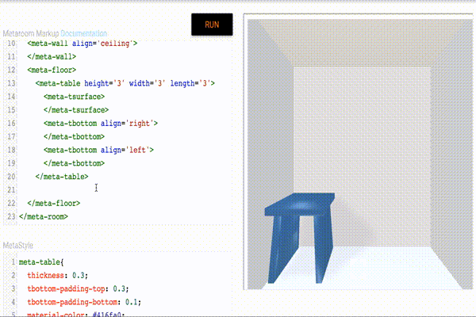

# MetaRoomMarkup (Alpha stage, V0)

[](https://gitter.im/MetaRoomMarkup/MetaRoomMarkup?utm_source=badge&utm_medium=badge&utm_campaign=pr-badge&utm_content=badge)

[What is MetaRoom Markup](http://vrcollab.com/2015/08/10/what-is-metaroom-markup.html)

MetaRoomMarkup applies the HTML/CSS way of positioning and styling to a 3D object.

``` html
<meta-table class='nice-table'>
  <meta-tsurface></meta-tsurface>
</meta-table>
```

``` css
.nice-table {
  table-padding-top: 0.4;
  table-padding-bottom: 0.4;
}
```

## Why MetaRoom Markup?

#### Dynamic scaling base on children's dimension


#### Styleable 3d objects


#### Display inline positioning


### Sandbox
A quick sandbox to test out

[Sandbox](http://vrcollab.com/VRcollab/)

### Getting Started

``` zsh
bower install MetaRoomMarkup
bower install webcomponentsjs
```

then include MetaRoomMarkup and webcomponentsjs in your html

``` html
<html>
  <head>
    <script src="./bower_components/webcomponentsjs/webcomponents.js"></script>
    <link rel="import" href="./bower_components/MetaRoomMarkup/dist/metaroom-markup.html">
  </head>

  <body>
    <meta-verse>
      <meta-style>
        meta-table{
          thickness: 0.3;
          tbottom-padding-top: 0.3;
          tbottom-padding-bottom: 0.1;
          material-color: #416fa0;
        }
        meta-wall{
          material-color: #d3d3d3;
        }
      </meta-style>
      <meta-room width='10' height='10' length='20'>
        <meta-wall align='left'>
        </meta-wall>
        <meta-wall align='right'>
        </meta-wall>
        <meta-wall align='front' meta-style='material-color: #e7e3e4;'>
        </meta-wall>
        <meta-wall align='back'>
        </meta-wall>
        <meta-wall align='ceiling'>
        </meta-wall>
        <meta-floor>
          <meta-table width='3' length='3' height='3'>
            <meta-tsurface>
            </meta-tsurface>
            <meta-tbottom align='right'>
            </meta-tbottom>
            <meta-tbottom align='left'>
            </meta-tbottom>
          </meta-table>
        </meta-floor>
      </meta-room>
    </meta-verse>
  </body>
</html>
```

## Markup Language Reference

## `<meta-verse>`
create a Metaverse world

## `<meta-style>`
Meta style will be like style sheet.

``` html
<meta-style>
  .nice-tabe {

  }
</meta-style>
```

## `<meta-room>`
creates a structure of the room

##### Attributes
- `width` type: number, default: 1
- `height` type: number. default 1
- `depth` type: number. default 1

## `<meta-wall>`
creates a wall in the meta-room

##### Attributes
- `align` change the alignment of wall. Default is front. Can be left, right, ceiling, front and back.

##### Meta style
- `material-color` css color code

##### Example

``` html
<meta-room>
  <meta-wall meta-style='material-color: red' align='left'></meta-wall>
  <meta-wall align='right'></meta-wall>
  <meta-wall align='front'></meta-wall>
  <meta-wall align='back'></meta-wall>
  <meta-wall align='ceiling'></meta-wall>
</meta-room>
```

## `<meta-floor>`
creates a floor in the meta-room

##### meta-style
- `material-color` css color code

##### Example

``` html
<meta-room>
  <meta-floor meta-style='material-color: #333333'></meta-floor>
</meta-room>
```

## `<meta-table>`
creates a table structure

##### meta-style
- `material-color` css color code
- `tbottom-padding`

``` html
<meta-floor>
  <meta-table meta-style='material-color: red;'>
    <meta-tsurface></meta-tsurface>
  </meta-table>
</meta-floor>
```

## `<meta-tsurface>`
creates a table surface

##### meta-style
- `material-color` css color code

## `<meta-tbottom>`
creates a table side

##### Attributes
- `align` change the alignment of wall. Default is front. Can be left, right, ceiling, front and back.

##### meta-style
- `material-color` css color code

### Disclaimer
it is a prototype.

### Any meta-tags that you want?
Open a github issue

### Roadmap

- add CSS to change the shader. We should support glsify
- add functional modeling for table and use CSS to change the arguments
- tab to change positions like tabindex
- How do we scroll in VR or 3D? There should be a path in the meta-room that follows all the tabindex, meta-link and meta-item
- meta-section to define a section and meta-label to guide user to the location along the meta-path region

### Introduction to metaroom-markup video:

[](http://www.youtube.com/watch?v=eoWaB1wufn4)


### Dev setup

    git clone git@github.com:MetaRoomMarkup/MetaRoomMarkup.git
    cd MetaRoomMarkup
    npm install
    bower install

Hot update during development

    gulp

Run the test
    # go to <http://localhost:8000/test/index.html> after gulp
