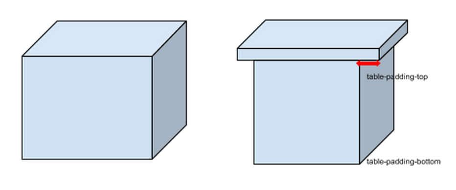

## MetaRoom markup
[](https://gitter.im/wizztjh/metaroom-markup?utm_source=badge&utm_medium=badge&utm_campaign=pr-badge)

MetaRoom markup is a 3D markup language that focuses on building 3D VR webpages.
Building a 3D VR webpage is not only about building games but in most cases, it is related to building a storefront, art gallery and showroom to provide users a sense of what the company is doing and selling.
With this, it will bring a sense of immersion and awe to a user that can’t be provided by a 2D webpage.

To build this type of 3D VR webpage, we need something that is more modular than a cube and cone to build a virtual storefront, such as a table, rack, room, wall, picture and text which is more helpful.
With the standardization of it, we can customize the table style using table-padding-top.

``` html
<meta-table class='nice-table'>
  <meta-tsurface></meta-tsurface>
</meta-table>
```

``` css
// style.metastyle

.nice-table {
  table-padding-top: 0.4;
  table-padding-bottom: 0.4;
}
```



As such, we do not need to send down the 3D object vertexes down to the client.

Normally, to create a 3D VR webpage using WebGL or game engine, we would need to set all of the x and y position of the 3D items. However, with MetaRoom markup, we will add all of the meta-item on a meta-floor and then automatically, all of the meta-item will be displayed inline just like in web development.

### Features
- **Smaller size**: Defines common 3D object with style instead of vertexes.
- **Display Inline**: Brings display inline to 3D VR
- **Extend**: With Web component, new meta component can be created, such as meta-elevator

[Demo](http://wizztjh.github.io/metaroom-markup/)


### How metaroom-markup would look like

``` html

<meta-verse skybox=''>
  <meta-room width='600px' height='600px'>
    <meta-wall align='left'>
      <poster src='VRcollab.png'></poster>
    </meta-wall>
    <meta-wall align='right'></meta-wall>

    <meta-wall align='front'></meta-wall>
    <meta-wall align='back'></meta-wall>

    <meta-wall align='ceiling'></meta-wall>

    <meta-floor style='display: grid; grid-row: 5; grid-column: 5'>
      > or we should use
      > <meta-grid>
      >   <meta-gbox grid-x='0' grid-y='0' ></meta-gbox>
      > </meta-grid>
      > i think we should remove the meta for all the table, tr and td

      <meta-table style='grid-x: 0; grid-y: 0'>
        <meta-thead>Cashier</thead>

        <meta-tbody>
          <meta-tr>

            <meta-td>
              <meta-item src='cashier.obj' title='cashier' onLook='pay()'></meta-item>
            </meta-td>

            <meta-td>
              <meta-item src='cashier.obj' title='cashier' onLook='pay()'></meta-item>
            </meta-td>

            <meta-td>
              <meta-item src='cashier.obj' title='cashier' onLook='pay()'></meta-item>
            </meta-td>

          </meta-tr>
          <meta-tr></meta-tr>
        </meta-tbody>
      </meta-table>

      <meta-rack height='200px' style='height: 200px'>
        <meta-rlevel>
          <meta-grid style='display: grid'>
            <meta-gbox style='grid-x: 0; grid-y: 0'>
              <meta-item src='red-shoe.obj' title='red shoe' onLook='addToCart()'></meta-item>
            </meta-gbox>
          </meta-grid>
        <meta-rlevel>
      </meta-rack>

      <meta-table style='grid-x: 5; grid-y: 5'>
        <meta-thead>Contact US</thead>

        <meta-tbody>
          <meta-tr>
            <meta-td>
              <meta-item src='phone.obj' alt='call us by +6598144461' pickup='true'></meta-item>
            </meta-td>
          </meta-tr>
        </meta-tbody>

      </meta-table>

      <meta-tablestyle='grid-x: 4; grid-y: 5'>
        <meta-thead>Achievements</meta-thead>
        <meta-tbody>
          <meta-tr>
            <meta-td>
              <meta-item src='best-game-ever-trophy.obj' alt='this is a trophy won by us on 2013' pickup='true'></meta-item>
            </meta-td>
          </meta-tr>
        </meta-tbody>
      </meta-table>
    </meta-floor>

  </meta-room>
</meta-verse>
```

### disclaimer
it is a prototype.

### Roadmap

- add test to all the elements
- add css to change the shader. We should support glsify
- add functional modelling for table and use css to change the arguments
- tab to change the position and look at of the user just like tabindex
- How do we do website scrolling in VR or 3D? There should be a path in the meta-room follows all the tabindex, meta-link and meta-item

### Introduction to metaroom-markup video:

[](http://www.youtube.com/watch?v=eoWaB1wufn4)


### Dev setup

    git clone https://github.com/wizztjh/metaroom-markup.git
    cd metaroom-markup
    npm install
    npm install gulp -g
    bower install

Hot update during development
    gulp

Demo
    # go to localhost:3000/demo/metaroom-markup-standard-spec.html

Run the test
    # go to localhost:3000/test/index.html after gulp
