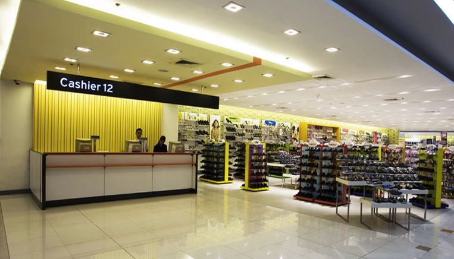

### How metaroom-markup would look like




``` html

<meta-verse skybox=''>
  <meta-room width='10' height='30' length='10'>
    <meta-wall align='left'>
      <meta-picture src='VRcollab.png'></meta-picture>
    </meta-wall>

    <meta-floor>
      <meta-table>
        <meta-tsurface>
          <meta-item src='cashier.obj' title='cashier' onLook='pay()'></meta-item>
          <meta-item src='cashier.obj' title='cashier' onLook='pay()'></meta-item>
          <meta-item src='cashier.obj' title='cashier' onLook='pay()'></meta-item>
        </meta-tsurface>

        <meta-tside align='front'>
          <meta-text>
            Cashier
          </meta-text>
        <meta-tside>

      </meta-table>

      <meta-rack height='10' >
        <meta-tsurface>
          <meta-item src='red-shoe.obj' title='red shoe' onLook='addToCart()'></meta-item>
        </meta-tsurface>

        <meta-tsurface>
          <meta-item src='blue-shoe.obj' title='red shoe' onLook='addToCart()'></meta-item>
        </meta-tsurface>
      </meta-rack>

      <meta-table>
        <meta-tside>Contact US</meta-tside>
        <meta-tbottom>
          <meta-item src='phone.obj' alt='call us by +6598144461' pickup='true'></meta-item>
        </meta-tbottom>
      </meta-table>

      <meta-table>
        <meta-tside>Achievements</meta-tside>
        <meta-tsurface>
          <meta-item src='best-game-ever-trophy.obj' alt='this is a trophy won by us on 2013' pickup='true'></meta-item>
        </meta-tsurface>
      </meta-table>
    </meta-floor>

    <meta-ceiling>
      <meta-label>Cashier 12</meta-label>
    </meta-ceiling>

  </meta-room>
</meta-verse>
```
